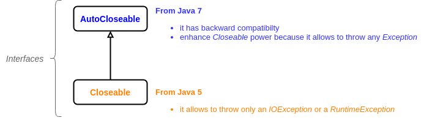

# Assertions and exceptions
+ [Overview](#overview)
+ [Assertions](#assertions)
    - [How to enable and disable assertions](#how-to-enable-and-disable-assertions)
    - [How to use correctly assertions](#how-to-use-correctly-assertions)
+ [Multi-catch](#multi-catch)
+ [Rethrowing exceptions](#rethrowing-exceptions)
+ [Try-with-resources statement](#try-with-resources-statement)
    - [Benefits](#benefits)
    - [Backward compatibility](#backward-compatibility)
+ [Suppressed exceptions](#suppressed-exceptions)
+ [Exam tricks](#exam-tricks)

## Overview
This module shows how to use assertions and how to manage exceptions with the new try statements provided by Java 8.

## Assertions
Assertions are used to check a condition that should be always true, else an ``AssertionError`` is thrown and it should never, ever be handled!

There are two types of assertions:
 * __really simple__
 * __simple__

The only difference between them is that the __simple__ assertion consists of a boolean expression followed by a primitive or object that could be converted into a String. 
It is added to the stack trace. Look at this [example](src/assertion/AssertionTypes.java).

### How to enable and disable assertions

> WARNINNG : Assertions are DISABLED by default at runtime!!!

Assertions are managed by specific JVM options:
 * enable assertions: ``-ea`` or ``-enableassertions`` 
 * DISABLE assertions: ``-da`` or ``-disableassertions`` 

Follow some examples of how to use options above in several ways: 
```shell script
// Enable assertions in general
java -ea com.assertion.MyClass
java -enableassertions com.assertion.MyClass

// DISABLE assertions in general
java -da com.assertion.MyClass
java -disableassertions com.assertion.MyClass

// Enable assertions in general, except for a class
java -ea -da com.assertion.MyClass

// Enable assertions in general, except for a package
java -ea -da com.assertion...
```

### How to use correctly assertions
Follow Oracle's engineers recommendations on how to use assertions:
 * Do use assertions
   - to validate arguments to a private method
   - in both private and public methods, to check for cases that you know are never, ever supposed to happen
   
 * Do not abuse with number of assertions!
 * Don't use assertions 
   - to validate arguments to a public method!
   - to validate command-line arguments!
 * Never, ever 
   - handle an assertion failure!
   - include code that could change the state of the program because they are not executed by default at runtime! [Here](src/assertion/AssertionIncorrectUse.java) an example
   
## Multi-catch
Multi-catch command was introduced on Java 7 with the purpose to merge several catch clauses in case they have exactly the same code.
 ```java
try {
    ...
} catch (SQLException | IOException e) {
    handleError();
}
```
The example above show the new syntax of the catch clause:
 1. the types of exception are separated by pipe characters
 2. there is only one variable
 3. the order of exception types is irrelevant
 4. the variable is **final** so you can't assign a new value (it does not compile!)
 
Look at [these examples](src/multi_catch/MultiCatchLegal.java) of legal multi-catch statement.

## Rethrowing exceptions
Some times we need to use the pattern "handle and declare" in order to process the exception caught and then rethrow it.
```java
public void couldThrowExceptions() throws IOException, IndexOutOfBoundException { }

public void rethrowExceptions() throws IOException, IndexOutOfBoundException {
    try {
        couldThrowExceptions();
    } catch (IOException | IndexOutOfBoundException e) {
        log(e);
        throw e;
    }
}
```
Remember that multi-catch was created to avoid duplicated code, while in this case log(e) is a kind of duplicate code 
because it is called for both ``IOException`` and ``IndexOutOfBoundException``.

That's why from Java 7 we could replace the list of exceptions on ``catch`` clause with **Exception**. 
It indicates to the compiler that **only the exceptions listed on the method signature** must be caught.

The benefits are:
 * you don't need to list exceptions on the ``catch`` clause
 * if the method can throw a new exception, you only need to add it to the ``throws`` clause of the method signature
 * if the method remove an exception from the ``throws`` clause of the method signature, you don't need to modify ``catch`` clause
 
 [``RethrowingException.java``](src/multi_catch/RethrowingException.java) shows how to catch multiple exceptions on Java 6, 7 and 8.
 
## Try-with-resources statement
This statement was invented in Java 7 to close automatically resources.
```java
try (Reader reader = new BufferedReader(new FileReader(file));
        AnotherResource ar = new AnotherResource()) {
    // do stuff
}
```
Let's see how does it works:
 1. declare your resources (classes which implements [``AutoCloseable``](https://docs.oracle.com/javase/7/docs/api/java/lang/AutoCloseable.html) interface) inside ``try`` declaration, separated by semicolon character
 2. ``catch`` clause is optional
 3. ``finally`` block that close resources is automatically generated and invoked, but you can add your own ``finally`` block that would be executed with the previous one

### Benefits
This new statement has greatly facilitated the effort of developers because it took away the responsibility to write code that close resources. 
The result is obvious: saving time and less code lines! 

### Backward compatibility
The new interface [``AutoCloseable``](https://docs.oracle.com/javase/7/docs/api/java/lang/AutoCloseable.html) was put on top of the existing interface
[``Closeable interface``](https://docs.oracle.com/javase/7/docs/api/java/io/Closeable.html) to guarantee the backward compatibility and 
allow to resources to throw any ``Excpetion``, as shown in the image below:



## Suppressed exceptions
It's totally legal and good practice throw an exception when ``AtuoCloseable`` and ``Closeable`` resources are closed. 
But what happen if another exception was already thrown previously?

Java manage this case by following one simple rule:
> the exception thrown by ``close()`` method is added to suppressed array if another exception was thrown previously

Look at [SuppressedExceptions.java](src/try_catch_with_resources/SuppressedExcpetions.java) to see a couple of examples.

## Exam tricks
> **"expression" meaning**
>
> Any question about assertions that refers to "expression" without specify if it is a boolean test or 
> the value to print in the stack trace, **ALWAYS** assume that it is a boolean expression 

> **"correct" meaning**
>
> "correct" in the context of assertions refers to how assertions SHOULD be used rather than how they legally COULD be used

> **"appropriate" != "legal"**
>
> "appropriate" always refers to the way in which something is supposed to be used, according to either 
> the developers of the mechanism or best practices officially embraced by Oracle

> **Single-catch parameter**
>
> Never, ever assign a new value to the single-catch parameter (classic try-catch)! \
> It compiles, but it is not recommended by Oracle!