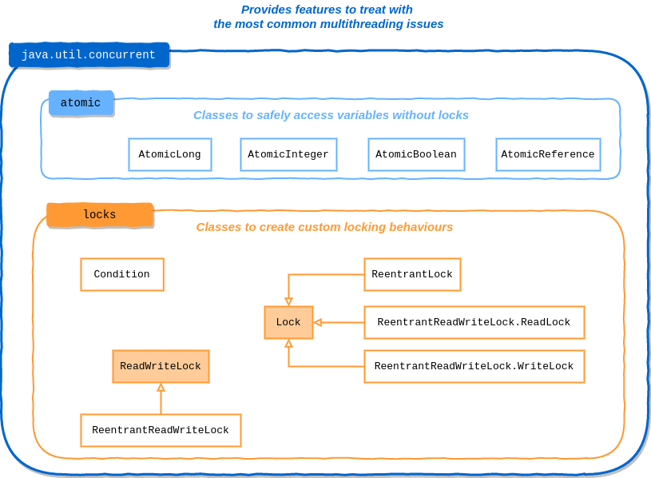
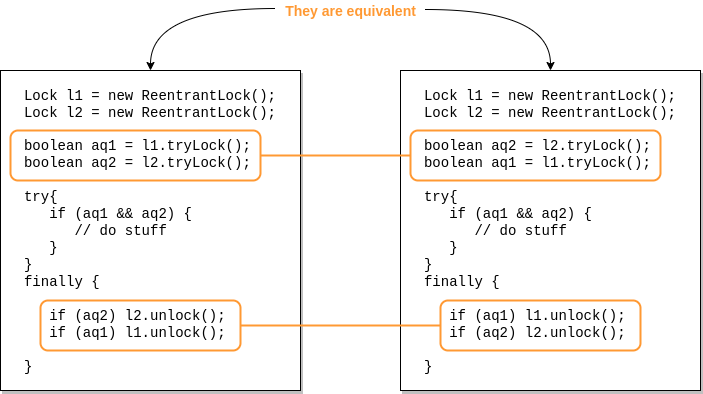
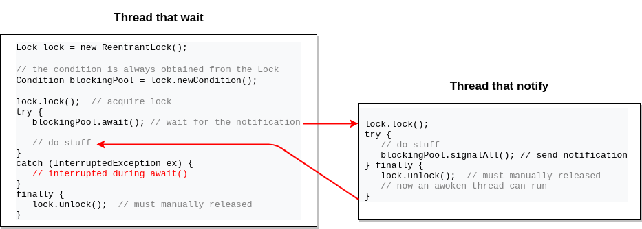
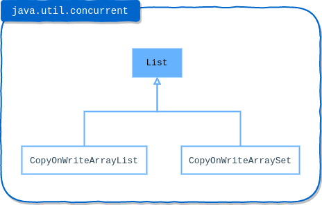
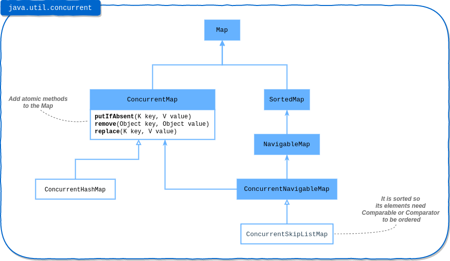
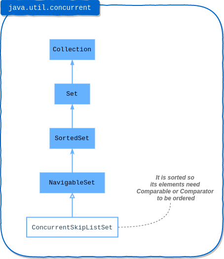

# Concurrency
+ [Overview](#overview)
+ [``java.util.concurrent``](#javautilconcurrent)
    - [Atomic package](#atomic-package)
    - [Locks package](#locks-package)
    - [``ReentrantLock``](#reentrantlock)
    - [``Condition``](#condition)
    - [``ReentrantReadWriteLock``](#reentrantreadwritelock)
+ [Concurrent collections](#concurrent-collections)
    - [Copy-on-Write Collections](#copy-on-write-collections)
    - [Concurrent collections](#concurrent-collections)
    - [Blocking Queues](#blocking-queues)
+ [Exam tricks](#exam-tricks)


## Overview
In this module we will see how to create and manage a multithreading application that use all the power of the modern 
multicore devices.

The package ``java.util.concurrent`` provides several classes to do it.

## ``java.util.concurrent``



### Atomic package
Classes of this package are thread-safe because they use CAS (Compare and Swap) instructions of the modern CPU. This 
behaviour is provided by method ``compareAndSet(...)``.

Look at [AtomicCounter](src/AtomicCounter.java).

### Locks package
Nowadays there is no vast difference between performance of ``synchronized`` keyword and ``java.util.concurrent`` classes.

Some reasons why use the ``java.util.concurrent.locks`` package: 
 * The ability to duplicate traditional synchronized blocks
 * Nonblock scoped locking: obtain a lock in one method and release it in another (this can be dangerous, though)
 * Multiple wait / notify / notifyAll pools per lock: threads can select which pool ( ``Condition`` ) they wait on
 * The ability to attempt to acquire a lock and take an alternative action if locking fails
 * An implementation of a multiple-reader, single-writer lock

### ``ReentrantLock``
We know that the first step to access shared resources in a multithreading application is always get the lock on the object.
We can get it with synchronized methods/blocks, but ``ReentrantLock`` gives us alternatives with some benefits.

The first thing to do is always get the lock instance as follow:
```java
Lock lock = new ReentrantLock();
```

At this point we have three options to lock the shared resource depending on our purpose:
 1. ``lock.lock()`` is the equivalent of synchronized methods/blocks. Get immediately the lock or blocks until acquire it
 2. ``lock.tryLock()`` if the lock fails come back later instead of wait until it is released
 3. ``lock.tryLock(2, TimeUnit.SECONDS)`` wait for the lock at maximum two seconds, else try again later to get the lock. Meanwhile it could be interrupted
 
The examples code are available on [ReentrantLockSamples](src/ReentrantLockSamples.java).

The method ``tryLock()``:
 * avoid the deadlock
 * remove the need to acquire locks in the same order across all threads, as with traditional synchronization
   
 * ``unlock()`` must be called if and only if the lock was acquired, else it throws ``IllegalMonitorStateException`` 
 
The sample [LiveLockSample](src/LiveLockSample.java) use the method ``tryLock()`` to avoid the deadlock, but there is 
a little possibility to lead to livelock. It can be fixed introducing a short random delay with ``Thread.sleep(int)`` 
any time it fails to acquire both locks.

### ``Condition``
The class ``Condition`` could replace wait-notify and wait-notifyAll. It works as below:



It has the advantage that you could define multiple conditions on the same lock and you can use it in case you can't use
the ``BlockingQueue``.

### ``ReentrantReadWriteLock``
This class allows multiple threads to read concurrently a non-thread-safe collection and to modify it by one thread at a time.
It produces a couple of locks, one to read and the other to write.

The example [ReadAndWriteNonThreadSafeCollection](src/ReadAndWriteNonThreadSafeCollection.java) shows the implementation details.

## Concurrent collections
We know that we can make a collection thread-safe synchronizing code that access the collection or generating a 
thread-safe collection with ``Collections.synchronizedList( new ArrayList() )``, but they have a low performance.

Better solutions are:
 * Copy-on-Write collections
 * Concurrent collections
 * Blocking Queues

### Copy-on-Write Collections


These implementations of ``List`` make the collection thread-safe in such a way that we don't need any synchronization 
or locking mechanism to allow concurrent access.

Basically, it uses a read-only collection because immutable objects are always thread-safe! 
Mutating operations generate a copy of the collection modified properly. That's why is recommended to use this collection
for a small amount of data.

Threads can loop on this collection only with the enhanced for-loop and the ``forEach()`` method because they both
use the ``Iterator`` that maintains the reference to the unchanging elements during the loop. 

### Concurrent collections


These implementations allow threads to read and write concurrently without create internal copies of the shared collection.
It means that the method ``size()``, for example, would be a bit inconsistent because while it is counting the elements some threads
were read and write data.



### Blocking Queues
They are used to exchange data between two or more threads. One use case is the producer-consumer problem.

The bounded queues has a bounded capacity (``ArrayBlockingQueue``, ``LinkedBlockingDeque``, ``LinkedBlockingQueue``) while
the special-purpose queue has zero capacity (``SyncrhonousQueue``) because they are used to exchange an object.

``DelayQueue`` allows to consume an object at a specific time. 
``LinkedTransferQueue`` can do almost everything you need from a queue. 

## Exam tricks
> **"probable" or "most likely"**
>
> On the exam, you might be asked about the "probable" or "most likely" outcome.  
> Unless you are asked to identify every possible outcome of a code sample, don't worry about unlikely results. 
> 
> For example, if the exam question uses ``Thread.sleep(1000)`` and nothing indicates that the thread would be interrupted while it was
> sleeping, it would be safe to assume that the thread would resume execution around one second after the call to sleep

> **thread-safe collection**
>
> Thread-safe collection DOES NOT MEAN the elements stored within the collection are thread-safe!!!
>
> You might have to use atomic variables, locks, synchronized code blocks or immutable (read-only) objects to make
> the objects referenced by a collection thread-safe