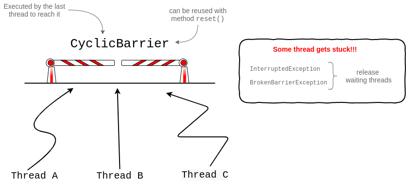

# Concurrency
+ [Overview](#overview)
+ [``java.util.concurrent``](#javautilconcurrent)
    - [Atomic package](#atomic-package)
    - [Locks package](#locks-package)
    - [``ReentrantLock``](#reentrantlock)
    - [``Condition``](#condition)
    - [``ReentrantReadWriteLock``](#reentrantreadwritelock)
+ [Concurrent collections](#concurrent-collections)
    - [Copy-on-Write Collections](#copy-on-write-collections)
    - [Concurrent collections](#concurrent-collections)
    - [Blocking Queues](#blocking-queues)
    - [``CyclicBarrier``](#cyclicbarrier)
+ [Exam tricks](#exam-tricks)


## Overview
In this module we will see how to create and manage a multithreading application that use all the power of the modern 
multicore devices.

The package ``java.util.concurrent`` provides several classes to do it.

## ``java.util.concurrent``


### Atomic package
Classes of this package are thread-safe because they use CAS (Compare and Swap) instructions of the modern CPU. This 
behaviour is provided by method ``compareAndSet(...)``.

Look at [AtomicCounter](src/AtomicCounter.java).

### Locks package
Nowadays there is no vast difference between performance of ``synchronized`` keyword and ``java.util.concurrent`` classes.

Some reasons why use the ``java.util.concurrent.locks`` package: 
 * The ability to duplicate traditional synchronized blocks
 * Nonblock scoped locking: obtain a lock in one method and release it in another (this can be dangerous, though)
 * Multiple wait / notify / notifyAll pools per lock: threads can select which pool ( ``Condition`` ) they wait on
 * The ability to attempt to acquire a lock and take an alternative action if locking fails
 * An implementation of a multiple-reader, single-writer lock

### ``ReentrantLock``
We know that the first step to access shared resources in a multithreading application is always get the lock on the object.
We can get it with synchronized methods/blocks, but ``ReentrantLock`` gives us alternatives with some benefits.

The first thing to do is always get the lock instance as follow:
```java
Lock lock = new ReentrantLock();
```

At this point we have three options to lock the shared resource depending on our purpose:
 1. ``lock.lock()`` is the equivalent of synchronized methods/blocks. Get immediately the lock or blocks until acquire it
 2. ``lock.tryLock()`` if the lock fails come back later instead of wait until it is released
 3. ``lock.tryLock(2, TimeUnit.SECONDS)`` wait for the lock at maximum two seconds, else try again later to get the lock. Meanwhile it could be interrupted
 
The examples code are available on [ReentrantLockSamples](src/ReentrantLockSamples.java).

The method ``tryLock()``:
 * avoid the deadlock
 * remove the need to acquire locks in the same order across all threads, as with traditional synchronization
   
 * ``unlock()`` must be called if and only if the lock was acquired, else it throws ``IllegalMonitorStateException`` 
 
The sample [LiveLockSample](src/LiveLockSample.java) use the method ``tryLock()`` to avoid the deadlock, but there is 
a little possibility to lead to livelock. It can be fixed introducing a short random delay with ``Thread.sleep(int)`` 
any time it fails to acquire both locks.

### ``Condition``
The class ``Condition`` could replace wait-notify and wait-notifyAll. It works as below:


It has the advantage that you could define multiple conditions on the same lock and you can use it in case you can't use
the ``BlockingQueue``.

### ``ReentrantReadWriteLock``
This class allows multiple threads to read concurrently a non-thread-safe collection and to modify it by one thread at a time.
It produces a couple of locks, one to read and the other to write.

The example [ReadAndWriteNonThreadSafeCollection](src/ReadAndWriteNonThreadSafeCollection.java) shows the implementation details.

## Concurrent collections
We know that we can make a collection thread-safe synchronizing code that access the collection or generating a 
thread-safe collection with ``Collections.synchronizedList( new ArrayList() )``, but they have a low performance.

Better solutions are:
 * Copy-on-Write collections
 * Concurrent collections
 * Blocking Queues

### Copy-on-Write Collections


These implementations of ``List`` make the collection thread-safe in such a way that we don't need any synchronization 
or locking mechanism to allow concurrent access.

Basically, it uses a read-only collection because immutable objects are always thread-safe! 
Mutating operations generate a copy of the collection modified properly. That's why is recommended to use this collection
for a small amount of data.

Threads can loop on this collection only with the enhanced for-loop and the ``forEach()`` method because they both
use the ``Iterator`` that maintains the reference to the unchanging elements during the loop. 

### Concurrent collections


These implementations allow threads to read and write concurrently without create internal copies of the shared collection.
It means that the method ``size()``, for example, would be a bit inconsistent because while it is counting the elements some threads
were read and write data.


### Blocking Queues
They are used to exchange data between two or more threads. One use case is the producer-consumer problem.

 * ``ArrayBlockingQueue``, ``LinkedBlockingDeque``, ``LinkedBlockingQueue`` are bounded queues with bounded capacity. [Here](src/BoundedQueue.java) an example 
 * ``SyncrhonousQueue`` is a special-purpose queue with zero capacity because they are used to exchange just one object
 * ``DelayQueue`` allows to consume an object at a specific time  
 * ``LinkedTransferQueue`` can do almost everything you need from a queue. Oracle recommend to use it due to its high efficiency. [Here](src/LinkedTransferQueueSample.java) an example
 
The most common methods to insert an object in the queue:
```java
// returns true if object added, false if duplicate objects are not allowed
// throws an IllegalStateException if the queue is bounded and full
boolean add(E e);

// returns true if object added, false if the queue is bounded and full
boolean offer(E e);

// Returns false if the object was not able to be inserted before the time indicated by the second and third parameters
boolean offer(E e, long timeout, TimeUnit unit);

// If needed, will block until space in the queue becomes available
void put(E e);
```

The most common methods to remove an object from the queue:
```java
// returns true if an equal object was found in the queue and removed, else returns false
boolean remove(Object o);

// removes the first object in the queue (the head) and returns it. 
// If the timeout expires before an object can be removed because the queue is empty, a null will be returned
E poll(long timeout, TimeUnit unit);

// removes the first object in the queue (the head) and returns it or returns null if the queue is empty
E poll();

// removes the first object in the queue (the head) and returns it, blocking if needed until an object becomes available
E take();
```

The most common methods to retrieve an object from the queue:
```java
// gets the head of the queue without removing it 
// throws a NoSuchElementException if the queue is empty
E element();

// gets the head of the queue without removing it. Returns a null if the queue is empty
E peek();
```

### ``CyclicBarrier``
In a multithreading application we usually need to control that two or more threads have done their work before to continue.
We can do it with ``CyclicBarrier``.



## Executors and ThreadPools
The architecture of our machine define a great limit for the number of threads that we can run concurrently, so it's a 
good practice to assign each need to a different class in order to make our application more modular and flexible. 
It is the programming principle called "separation of concerns".

The ``Executors`` class is an high level management of threads, instead of create and start them manually. Can you imagine 
to manage manually thousands of threads?

At this point we understand perfectly that the number of threads you can run on your machine/servers depends on several aspects and 
there is no the perfect recipe:
 1. Number of cores of your CPU
 2. Scheduler policy
 3. CPU intensive and I/O intensive (e.g. we can improve the performance of our application putting to sleep a thread that
    made an I/O request when the data is not available in the memory)
 4. Management of I/O operations
 5. and so on...
 


## Exam tricks
> **"probable" or "most likely"**
>
> On the exam, you might be asked about the "probable" or "most likely" outcome.  
> Unless you are asked to identify every possible outcome of a code sample, don't worry about unlikely results. 
> 
> For example, if the exam question uses ``Thread.sleep(1000)`` and nothing indicates that the thread would be interrupted while it was
> sleeping, it would be safe to assume that the thread would resume execution around one second after the call to sleep

> **thread-safe collection**
>
> Thread-safe collection DOES NOT MEAN the elements stored within the collection are thread-safe!!!
>
> You might have to use atomic variables, locks, synchronized code blocks or immutable (read-only) objects to make
> the objects referenced by a collection thread-safe

> **When ``InterruptedException`` is thrown?**
>
> Any method that blocks or waits for any period may throw an ``InterruptedException``