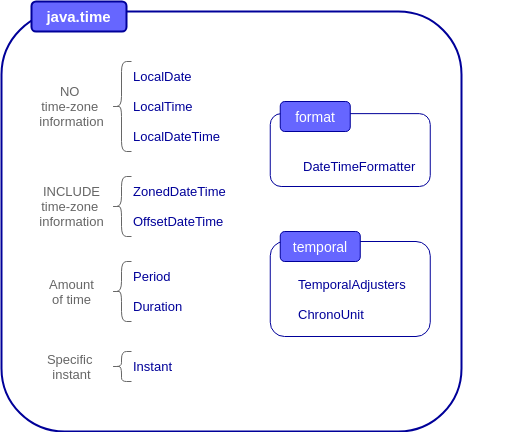
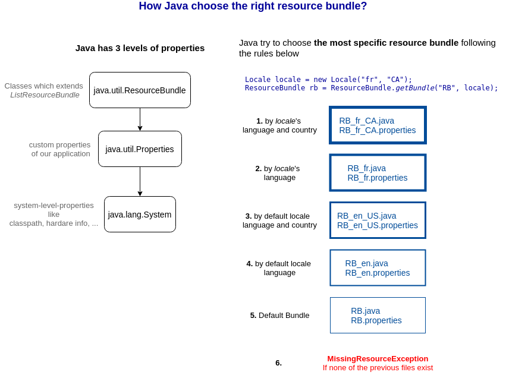

# Dates, Times, Locales and Resource Bundle
+ [Overview](#overview)
+ [Dates and times](#dates-and-times)
+ [ZONED Dates and times](#zoned-dates-and-times)
+ [Date and time adjustment](#date-and-time-adjustment)
+ [Periods, Durations and Instants](#periods-durations-and-instants)
    - [NBA match reminders](#nba-match-reminders)
+ [Locale](#locale)
+ [Properties files](#properties-files)
+ [Resource bundle](#resource-bundle)
    - [Java rules to choose the right resource bunble](#java-rules-to-choose-the-right-resource-bunble)
+ [Exam tricks](#exam-tricks)


## Overview
This module includes one of the biggest news of Java 8, the package ``java.time.*`` that will totally replace the oldest classes:
* ``java.util.Date``
* ``java.util.Calendar``
* ``java.text.DateFormat`` 

It provides intuitive features to work with datetime objects, amounts of time, timezones and it allows to format dates and times in several ways.

We will see some classes to work with date-based and time-based events.

Finally, we will talk about the most important aspects of ``Locale``, properties files and resource bundle.

## Dates and times



The exam will be focused on the following classes of this new package. The image show the most common methods to create and adjust datetime objects.


Take a look at [the code examples](src/date_and_time/DateAndTime.java) to understand how to create and adjust datetime objects.

## ZONED Dates and times
> ``ZonedDateTime`` = ``LocalDateTime`` + time zone

Follow the basic concepts of time zones:
 * all time zones are based on GMT (Greenwich Mean Time) which use as time standard UTC (Coordinated Universal Time).
 * each time zone is represented as a ``ZoneId``
    > NOTE: the complete list of time zones is not available on the documentation of class ``ZoneId``, but it can be obtained by code:
    > ```java
    > Set<String> zoneIds = ZoneId.getAvailableZoneIds();
    > List<String> zoneList = new ArrayList<String>(zoneIds);
    > Collections.sort(zoneList);
    > for (String zoneId : zoneList) {
    >       System.out.println(zoneId);
    > }
    > ```
 * ``ZoneRules`` has all the rules about time zones, daylight savings and standard time
 * ``OffsetDateTime`` is a fixed datetime and offset independent from``ZoneRules``
 
 Look at [``DateTimeWithTimeZone``](src/date_and_time/DateTimeWithTimeZone.java) to see some basic operation with ``ZonedDateTime``.

## Date and time adjustment
``LocalDateTime`` and ``ZonedDateTime`` are immutable, but you can create a new datetime object from them with the adjusters provided by ``java.time.*`` package.

There are some example in [DateTimeAdjusters](src/date_and_time/DateTimeAdjusters.java)

## Periods, Durations and Instants
The new package ``java.time.*`` provides two classes to represent a period of time: 
 * ``Period`` >= 1 DAY
 * ``Duration`` < 1 DAY
 
Both could be added-to or subtracted-from ``LocalDateTime`` and ``ZonedDateTime``. For instance, if you need to set a reminder 
one week before an event you could do it:
```java
ZonedDateTime event = ZonedDateTime.of(2020, 8, 2, 14, 30, 0, 0, ZoneId.of("Europe/Madrid"));
Period oneMonthPeriod = Period.ofMonths(1);
ZonedDateTime reminder = event.minus(oneMonthPeriod); 
```

``ChronoUnit`` is an enum that represent a unit of time (minutes, months...). This class is commonly used when we need to calculate 
the time difference between two ``LocalTime`` and create a ``Duration`` from it.
```java
LocalTime beginning = LocalTime.parse("11:23:00");
LocalTime end = LocalTime.parse("14:53:00");
long timeDifference = ChronoUnit.MINUTES.between(beginning, end);
Duration durationMinutes = Duration.ofMinutes(timeDifference);
System.out.println("Duration is " + durationMinutes);
```
The output is **PT3H30M**, where PT means "period of time" and the rest of the string means 3 hours and 30 minutes.

### NBA match reminders
We talk about several features of the new ``java.time.*`` package that are very intuitive and simplify the way to deal with datetime objects. 
But now it's time to see a real example in order to understand how to make the most their power!

Suppose that Jose is living in Seville (Spain) and he love NBA! He would like to watch live match, but he need a reminder because they will play early in the morning in his time zone.
Moreover, Jose and his American friend Mike like to comment on the match the day after it, so Jose need another reminder to be sure that Mike will be awake when he will make the video call. 

The class [``NBAmatchReminder``](src/date_and_time/NBAMatchReminders.java) shows this scenario.

## Locale
The ``Locale`` class is in charge of to internationalize your code. For the exam is enough to know: 
 1. You can only find these constructors:
    > Locale(String language) \
      Locale(String language, String country)
 
 2. The same ``ZonedDateTime`` is formatted in several ways depending on the locale
  
 3. Both language and country are given in terms of default locale or other locales
 
There are some samples into [``Locales``](src/locale/Locales.java).

## Properties files
Properties files are used to externally store configuration settings and parameters of our applications. There are three types of properties:
 1. ``java.lang.System`` (**NOT in the exam**): holds system information like
 2. ``java.util.Properties``: custom properties files for our application
 3. ``java.util.ResourceBundle``: add localization and internationalization to our applications using ``java.util.Properties``

On the exam we will find the following methods of the ``Properties`` class:
 > ```java
 > String getProperty(String key)
 > void list(PrintStream out)
 > void load(InputStream inStream)
 > Object setProperty(String key, String value)
 > void store(OutputStream out, String headerComment)
 > ```

Check out the examples on [``ReadWriteProperties``](src/properties/ReadWriteProperties.java).

## Resource bundle
Java allows to create our own class that extends ``ListResourceBundle`` in order to store key-value pairs where the value could be any object. 
Take a look at the example into [``Locales``](src/locale/Locales.java) where the method ``printLabelsEnCaResourceBundle()`` print the content of [``Labels_en_CA.java``](src/locale/Labels_en_CA.java).

### Java rules to choose the right resource bunble


## Exam tricks
> **``Instant`` is always displayed in UTC!!!**
>
> Even if you get an ``Instant`` from a ``ZonedDateTime``, it is always displayed in UTC. That's why the method ``toString()`` use the format 
> [``DateTimeFormatter.ISO_INSTANT``](https://docs.oracle.com/javase/8/docs/api/java/time/format/DateTimeFormatter.html#ISO_INSTANT) as indicated in
> [the official documentation](https://docs.oracle.com/javase/8/docs/api/java/time/Instant.html#toString--)

> **Oracle recommendation**
>
> Even if ``java.util.Properties`` inherits from ``java.util.Hashtable``, Oracle encourages you to use the methods of ``Properties`` 
  class because they use arguments of type String

> **Advantages of using resource bundle**
>
> When in the exam you encounter questions about the advantages of using resource bundle you should refer to Java API reasons:
>  * Be easily localized, or translated, into different languages  
>  * Handle multiple locales at once
>  * Be easily modified later to support even more locales"

> **Format used by ``toString()``**
>
> In the exam you will find questions like this: which will produce the following output in the console? ``2018--12-01T10:10``
> 
> You can answer correctly only if you know the format used by ``toString()`` of the corresponding instance printed on the console.
> Here the official documentation links for the classes involved in the exam:
>  * [``ZonedDateTime``](https://docs.oracle.com/javase/8/docs/api/java/time/ZonedDateTime.html#toString--)
>  * [``LocalDateTime``](https://docs.oracle.com/javase/8/docs/api/java/time/LocalDateTime.html#toString--)
>  * [``LocalDate``](https://docs.oracle.com/javase/8/docs/api/java/time/LocalDate.html#toString--)
>  * [``LocalTime``](https://docs.oracle.com/javase/8/docs/api/java/time/LocalTime.html#toString--)