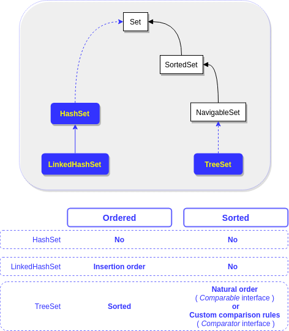

# Object orientation
+ [Overview](#overview)
+ [Override ``equals()``](#override-equals)
+ [Override ``hashCode()``](#ovverride-hashcode)
+ [Collections](#collections)
    - [Collections framework](#collections-framework)
        * [Core interfaces](#core-interfaces)
        * [Implementation classes](#implementation-classes)
    - [Choose the best collections implementation class](#choose-the-best-collections-implementation-class)
        + [``List``](#list)
        + [``Set``](#set)
        + [``Map``](#map)
        + [](#)
+ [Exam tricks](#exam-tricks)

## Overview
This module consists of three main topics:
 1. ``equals()`` and ``hashCode()``: why we should override them, what are their contracts and how they are related
 2. Java collections: the most important classes to create collections and how they work
 3. Java generics
 
Don't worry! The scope of the exam is not to be a guru of Java collections and generics because they are huge topics.
We will learn just the most important aspects for the exam and some extra knowledge to have a strong base for the future. 

## Override ``equals()``


| equlas() contract| |
| :---: | :---: |
| reflexive | ``x.equals(x)`` is always ``true`` |
| symmetric | ``x.equals(y)`` is ``true`` <br/> if and only if <br/> ``y.equals(x)`` is ``true`` |
| transitive | if ``x.equals(y)`` is ``true`` <br/> and ``y.equals(z)`` is ``true`` <br/> then ``x.equals(z)`` MUST BE ``true``  |
| consistent | multiple invocatoins of ``x.equals(y)`` return the same value |
| ``null`` reference | ``x.equals(null)`` is always ``false`` |

## Ovverride ``hashCode()``
The hashcode is used to increase the performance of large collections based on hashtable during the storing and localization of data.

As in the same bucket of the hashtable we can have more than one entry, the retrieval process consists of two steps:
 1. use ``hashCode()`` to find the bucket
 2. use ``equals()`` to locate the right element
 
It means that if two objects are considered equal using the ``equals()`` method, then they MUST have identical hashcode values. 
So to be truly safe, your rule of thumb should be:
 > if you override ``equals()`` , override ``hashCode()`` as well

| hashCode() contract|
| ----   |
| Provided that no information used in equals() comparisons on the object is modified, <br/> multiple invocations of ``hashCode()`` on the same object MUST return the same integer |
| if ``x.equals(y)`` is ``true`` <br/> x and y MUST HAVE the same hashcode |
| if ``x.equals(y)`` is ``false`` <br/> is NOT REQUIRED that x and y hashcode must be distinct |

## Collections
This section resumes the most important details concerning to the interfaces and classes of the ``Collections`` framework involved in the exam.

### Collections framework
Follow the interfaces and implementation classes of Collections framework which you should know for the exam and 
that could be considered a strong base to work with Java collections.

#### Core interfaces


#### Implementation classes





### How to choose the best implementation
How to choose the best implementation class of collections framework for our purpose?

#### List
 * **``LinkedList``**
    * fast insertion and deletion
 * **``ArrayList``** 
    * fast iteration
    * you don't expect a lot of insertion and deletion
    
#### Set
 * **``HashSet``**
    * no duplicates
    * no order
    * higher access performance depending on ``hashCode()`` implementation
  * **``LinkedHashSet``**
    * iterate through the elements in the order in which they were inserted
  * **``TreeSet``**
    * natural order (in ascending order) or custom order (by ``Comparator``)
    
#### Map
 * **``HashMap``**
    * no order
    * no sorter
    * allows null keys or values
    * higher access performance depending on ``hashCode()`` implementation
 * **``Hashtable``**
    * synchronized
    * does NOT allow null keys or values
 * **``LinkedHashMap``**
    * fast iteration
 * **``TreeMap``**
    * natural order (in ascending order) or custom order (by ``Comparator``)
 
#### Queue
 * **``PriorityQueue``**
    * natural order (in ascending order) 
    * custom order (by ``Comparator``)
    * custom priority-in, priority-out where the order represents their RELATIVE priority
 * **``ArrayDeque``**
    * to implement queue or stack
    * double-ended queue
    * high performance

## Exam tricks
> **Valid override of ``equals()``, ``hashCode()`` and ``toString()``** \
> Make sure to know the rules of overriding to avoid the following errors:
>   ```java
>   class Foo {
>     // it is not a valid override because it should be public hashCode() contract
>     boolean equals(Object o) { } 
>     int hashCode() { } 
>     String toString() { } 
>   }
>   ```
>   ```java
>   class Foo {
>     // it's not an override, but a valid overload because the argument type is not Object 
>     public boolean equals(Foo o) { }
>   }
>   ```

> **hashcode tricky exam questions** \
> appropriate/correct != legal != efficient
> 
> It is legal return the same hashcode for every instance, but it's terribly inefficient because it means that
> all objects will be put in the same bucket

> **``HashSet`` and ``HashSet`` warning** \
> These classes does not allow duplicates as dictated by ``Set`` contract. 
> For these reason, the objects managed with these classes MUST override``hashCode()``

> **Interface means interface, class means class** \
> If you are asked to choos an interface, choose an interface, NOT a class! And vice versa...