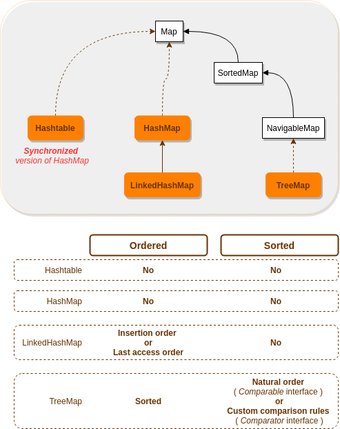

# Generics and collections
+ [Overview](#overview)
+ [Override ``equals()``](#override-equals)
+ [Override ``hashCode()``](#ovverride-hashcode)
+ [Collections](#collections)
    - [Collections framework](#collections-framework)
        * [Core interfaces](#core-interfaces)
        * [Implementation classes](#implementation-classes)
    - [Choose the best collections implementation class](#choose-the-best-collections-implementation-class)
        + [``List``](#list)
        + [``Set``](#set)
        + [``Map``](#map)
        + [``Queue``](#queue)
    - [Using Collections](#using-collections)
        + [Boxing with ``==`` and ``equlas()``](#boxing-with--and-equlas)
        + [``Comparable`` vs ``Comparator``](#comparable-vs-comparator)
        + [Sorting collections and arrays](#sorting-collections-and-arrays)
        + [Searching collections and arrays](#searching-collections-and-arrays)
        + [Using List](#using-list)
        + [Using Set](#using-set)
        + [Using Map](#using-map)
        + [Searching ``TreeSets`` and ``TreeMaps``](#searching-treesets-and-treemaps)
        + [Backed collections](#backed-collections)
        + [Priority queue](#priority-queue)
        + [``ArrayDeque``](#arraydeque)
        + [Key methods in ``Arrays`` and ``Collections``](#key-methods-in-arrays-and-collections)
        + [Key methods in ``List``, ``Set`` and ``Map``](#key-methods-in-list-set-and-map)
+ [Exam tricks](#exam-tricks)

## Overview
This module consists of three main topics:
 1. ``equals()`` and ``hashCode()``: why we should override them, what are their contracts and how they are related
 2. Java collections: the most important classes to create collections and how they work
 3. Java generics
 
Don't worry! The scope of the exam is not to be a guru of Java collections and generics because they are huge topics.
We will learn just the most important aspects for the exam and some extra knowledge to have a strong base for the future. 

## Override ``equals()``


| equlas() contract| |
| :---: | :---: |
| reflexive | ``x.equals(x)`` is always ``true`` |
| symmetric | ``x.equals(y)`` is ``true`` <br/> if and only if <br/> ``y.equals(x)`` is ``true`` |
| transitive | if ``x.equals(y)`` is ``true`` <br/> and ``y.equals(z)`` is ``true`` <br/> then ``x.equals(z)`` MUST BE ``true``  |
| consistent | multiple invocatoins of ``x.equals(y)`` return the same value |
| ``null`` reference | ``x.equals(null)`` is always ``false`` |

## Ovverride ``hashCode()``
The hashcode is used to increase the performance of large collections based on hashtable during the storing and localization of data.

As in the same bucket of the hashtable we can have more than one entry, the retrieval process consists of two steps:
 1. use ``hashCode()`` to find the bucket
 2. use ``equals()`` to locate the right element
 
It means that if two objects are considered equal using the ``equals()`` method, then they MUST have identical hashcode values. 
So to be truly safe, your rule of thumb should be:
 > if you override ``equals()`` , override ``hashCode()`` as well

| hashCode() contract|
| ----   |
| Provided that no information used in equals() comparisons on the object is modified, <br/> multiple invocations of ``hashCode()`` on the same object MUST return the same integer |
| if ``x.equals(y)`` is ``true`` <br/> x and y MUST HAVE the same hashcode |
| if ``x.equals(y)`` is ``false`` <br/> is NOT REQUIRED that x and y hashcode must be distinct |

## Collections
This section resumes the most important details concerning to the interfaces and classes of the ``Collections`` framework involved in the exam.

### Collections framework
Follow the interfaces and implementation classes of [the Collections framework](https://docs.oracle.com/javase/8/docs/technotes/guides/collections/index.html) 
which you should know for the exam and that could be considered a strong base to work with Java collections.

#### Core interfaces


#### Implementation classes




### How to choose the best implementation
How to choose the best implementation class of collections framework for our purpose?

#### List
 * **``LinkedList``**
    * fast insertion and deletion
 * **``ArrayList``** 
    * fast iteration
    * you don't expect a lot of insertion and deletion
    
#### Set
 * **``HashSet``**
    * no duplicates
    * no order
    * higher access performance depending on ``hashCode()`` implementation
  * **``LinkedHashSet``**
    * iterate through the elements in the order in which they were inserted
  * **``TreeSet``**
    * natural order (in ascending order) or custom order (by ``Comparator``)
    
#### Map
 * **``HashMap``**
    * no order
    * no sorter
    * allows null keys or values
    * higher access performance depending on ``hashCode()`` implementation
 * **``Hashtable``**
    * synchronized
    * does NOT allow null keys or values
 * **``LinkedHashMap``**
    * fast iteration
 * **``TreeMap``**
    * natural order (in ascending order) or custom order (by ``Comparator``)
 
#### Queue
 * **``PriorityQueue``**
    * implements ``Queue`` interface
    * natural order (in ascending order) 
    * custom order (by ``Comparator``)
    * custom priority-in, priority-out where the order represents their RELATIVE priority
 * **``ArrayDeque``**
    * implements both ``Queue`` and ``Deque`` interfaces
    * to implement queue or stack
    * double-ended queue
    * high performance

### Using Collections
We know the most important interfaces and classes of the Collections framework and how to choose the best collection
implementation for our purpose. Now it's time to know how to use them!

#### Boxing with ``==`` and ``equlas()``
In order to save memory, two instances of the following wrapper objects (created through boxing) will always be == when their
primitive values are the same:
 * Boolean
 * Byte
 * Character from \u0000 to \u007f (7f is 127 in decimal)
 * Short and Integer from –128 to 127
> **WARNING**
>
> Take care with Integer and Short, as shows the example below:
> ```java
> Integer a1 = 127;
> Integer a2 = 127;
> Integer b1= 128;
> Integer b2 = 128;
> System.out.println( a1 == a2 ); // true because the value belong to [-128, 127]
> System.out.println( b1 == b2 ); // false based on the above
> ```

The second thing you MUST remember is that wrapper reference variable can be ``null``. 
It means that the developer is in charge of to check it, else JVM will throws a ``NullPointerException`` at runtime. 

#### ``Comparable`` vs ``Comparator``
It's really important to understand what are these interfaces and how to use them because of many reasons.

They are used to impose a total ordering on collections of objects:
 * ``Comparable`` defines a natural order (alphabetically, number value, ...)
 * ``Comparator`` defines a custom order based on object's properties
    
> **WARNING**
>
> If you try to sort a collections of objects for which the total ordering is not defined, 
> the compiler will get something like this:
> ```java
> TestCollectionSorting.java:13: cannot find symbol
> symbol : method sort(java.util.ArrayList<DVDInfo>)
> location: class java.util.Collections
> Collections.sort(dvdlist);
> ```

The table highlight the differences between these interfaces.

| Difference | ``Comparable`` | ``Comparator`` |
| :--------- | :------------- | :------------- |
| Method syntax | ``int a.compareTo(b)`` | ``int compare(a, b)`` |
| Class impact | The class must be changed accordingly | The comparator is implemented on a separated class |
| Multiple ways to order objects | No | Yes, as much as I need |
| Implemented by some Java API classes | Yes, for example ``String`` , wrapper classes, ``LocalDate``, ``LocalTime`` ... | No, because it was introduced to define a custom order |
| Replaceable with Lambda | No | Yes, because it is a [functional interface](https://docs.oracle.com/javase/8/docs/api/java/lang/FunctionalInterface.html) |

Look at the examples in [``SortList``](src/list/SortList.java) to understand better how work these interfaces.

#### Sorting collections and arrays
For the exam you should know that we can sort a collections in the following ways:
```java
Collections.sort(list)
Collections.sort(list, comparator)
Arrays.sort(array)
Arrays.sort(array, comparator)
```
Moreover, the elements of collections/arrays MUST BE mutually comparable. Generally, objects of different types have not this characteristic.

#### Searching collections and arrays
The following rules apply:
 * Searches are performed using the ``binarySearch()`` method that return the index of the element (SUCCESSFUL) or the insertion point (UNSUCCESSFUL) 
 * You MUST sort the collection/array before searching, else the result is not predictable
 * You MUST invoke ``binarySearch()`` version related to the order applied by sorting (natural order or ``Comparator``)

#### Using List
The element of a ``List`` could be examined by iterator.
```java
// using the generic syntax to create the Iterator
Iterator<Dog> i = d.iterator();
while (i.hasNext()) {
    Dog dog = i.next(); // cast not required
    System.out.println(dog.getName());
}

// using the classic iterator
Iterator i = d.iterator();
while (i.hasNext()) {
    Dog dog = (Dog) i.next(); // cast required because we declared an iterator of objects
    System.out.println(dog.getName());
}
```

#### Using Set
You can print ``HashSet`` or ``LinkedHashSet`` of different types of objects because they are not SORTED.

It's not the same for ``TreeSet`` because the elements of sorted collections MUST BE mutually comparable! It produces a runtime ``ClassCastException``.

#### Using Map
Any classes that you use as a part of the keys for that map MUST OVERRIDE the ``hashCode()`` and ``equals()`` methods, 
else the code will compile, run, but it will not retrieve objects from the map. 

```java
// 1. They are legals
// 2. They successfully retrieve objects from a Map
// 3. They are both terribly inefficient
// 4. The first is a bit more efficient than the second that provides the same hashcode for any object
public int hashCode() { return name.length(); }
public int hashCode() { return 4; }
```

> **WARNING** \
> If you change the value of one or more object used to calculate the hashcode, the objects related to old hashcode will not be retrieved!!!

#### Searching ``TreeSets`` and ``TreeMaps``
Probably you won't get any questions on these topics, but it's better to be ready.


#### Backed collections
Some of the classes in the ``java.util`` package support the concept of backed collections.

Basically you can create a collection from another and each one can reflect its changes to the other. Look at the example on 
[``BackedCollection``](src/backed_collection/BackedCollection.java) to understand better how does it work.

For the exam you should remember the methods and the rules below:


1. method invoked with end point + boolean always means IS INCLUSIVE
2. unless specifically indicated by a boolean argument, a subset's starting point will always BE INCLUSIVE

#### Priority queue
The elements are sorted by natural order or by ``Comnparator``.
```java
offer(e);   // add the element to the PriorityQueue 
peek();     // returns the highest-priority element in the queue without removing it
poll();     // returns the highest-priority element AND removes it from the queue
```

Take a look at the examples on[``PriorityQueueSample``](src/queue/PriorityQueueSample.java)

#### ``ArrayDeque``
This class is not synchronized and implements both the ``Queue`` interface and the ``Deque`` (double-ended queues) interface, so there are several methods 
with different names that do the same thing.
```java
// add on the end
offer(e) 
add(e) 

// add on the front
offerFirst(e) 
push(e) 
addFirst(e)

// returns the first element without delete it
peek()

// return and remove the first element
poll()
pop()

// return and remove the last element
pollLast()
removeLast()
```
Depending on the method invoked to get en element from an empty deque, the result is different:
 * ``pop()`` and ``remove()`` throws a ``java.util.NoSuchElementException``
 * ``poll()`` return ``null``
 
Take a look at the examples on[``ArrayDequeSample``](src/deque/ArrayDequeSample.java)

#### Key methods in ``Arrays`` and ``Collections``


#### Key methods in ``List``, ``Set`` and ``Map``


## Exam tricks
> **Valid override of ``equals()``, ``hashCode()`` and ``toString()``** 
>
> Make sure to know the rules of overriding to avoid the following errors:
>   ```java
>   class Foo {
>     // it is not a valid override because it should be public hashCode() contract
>     boolean equals(Object o) { } 
>     int hashCode() { } 
>     String toString() { } 
>   }
>   ```
>   ```java
>   class Foo {
>     // it's not an override, but a valid overload because the argument type is not Object 
>     public boolean equals(Foo o) { }
>   }
>   ```

> **Hashcode tricky exam questions**
>
> appropriate/correct != legal != efficient
> 
> It is legal return the same hashcode for every instance, but it's terribly inefficient because it means that
> all objects will be put in the same bucket

> **``hashCode()`` is a MUST when...**
>
> ``HashSet`` and ``LinkedHashSet``does not allow duplicates as dictated by ``Set`` contract. 
> It means that ``equals()`` must be override to identify duplicates, so you MUST override ``hashCode()`` too

> **Interface means interface, class means class**
>
> If you are asked to choos an interface, choose an interface, NOT a class! And vice versa...

> **Take care about argument type!**
>
> ``equals()`` take an argument of type ``Object``
> ``compareTo()`` take an argument of the type you are sorting

> **Diamond syntax reminder**
> ```java
> ArrayList<String> stuff = new ArrayList<>() // legal from Java 7
> 
> List<> stuff = new ArrayList<String>(); // NOT legal
> ```

> **``Arrays.asList(array)``**
>
> This method generate a List from an array. From this point, when you update one of them, the other is updated automatically!!!

> **Natural ordering detail**
>
> Remember for the exam that:
>  * spaces sort before characters 
>  * that uppercase letters sort before lowercase characters
> ```java
> String[] sa = {">ff<", "> f<", ">f <", ">FF<" }; // ordered?
> PriorityQueue<String> pq3 = new PriorityQueue<String>();
> for(String s : sa)
>     pq3.offer(s);
> for(String s : sa)
>     System.out.print(pq3.poll() + " ");
> ```
> The output is  > f< >FF< >f < >ff<