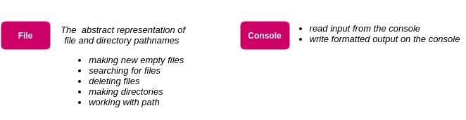
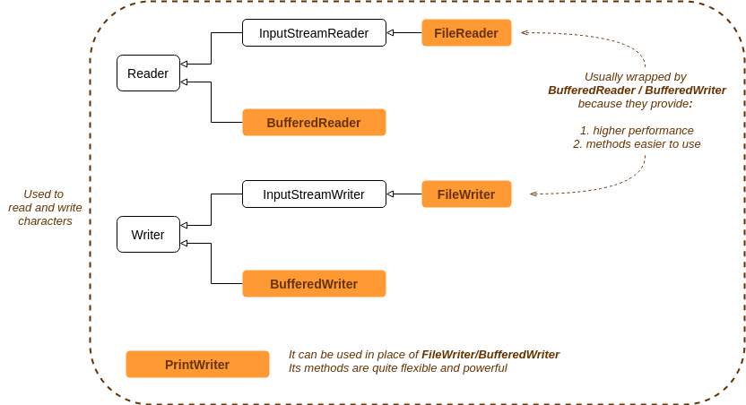
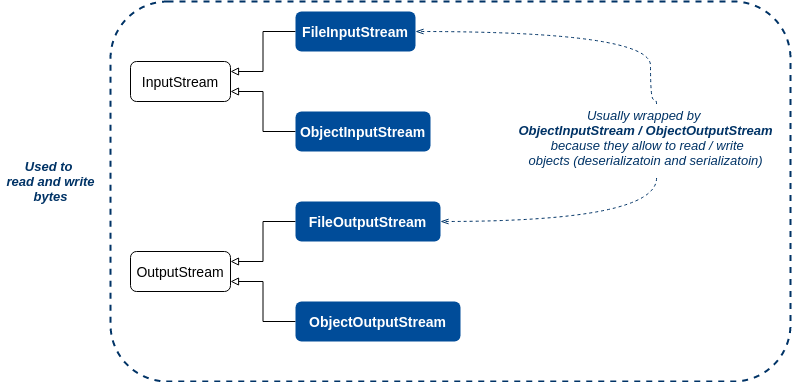
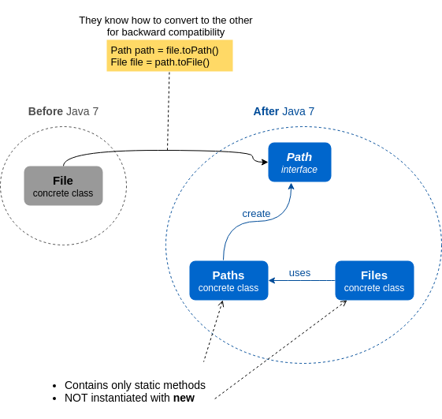

# I/O and NIO.2
+ [Overview](#overview)
+ [Java I/O fundamentals](#java-io-fundamentals)
    - [I/O classes involved in the exam](#io-classes-involved-in-the-exam)
    - [Combining I/O classes](#combining-io-classes)
    - [Work with I/O files and directories](#work-with-io-files-and-directories)
+ [Java NIO.2](#java-nio2)
    - [``Files``, ``Path`` and ``Paths``](#files-path-and-paths)
        + [Work with NIO 2 files and directories](#work-with-nio-2-files-and-directories)
        + [Work with NIO 2 paths](#work-with-nio-2-paths)
    - [File attributes](#file-attributes)
    - [``DirectoryStream``](#directorystream)
    - [File visitors](#file-visitors)
    - [``PathMatcher``](#pathmatcher)
        + [Globs](#globs)
    - [``WatchService``](#watchservice)
    - [Clean temporal directory utility](#clean-temporal-directory-utility)
+ [Exam tricks](#exam-tricks)

## Overview
This module consists of two main sections:
 1. **I/O**
    - The fundamentals of input/output operations focused on ``java.io`` package
    - The exam is based on I/O features to read/write characters and objects (serialization/deserialization)
  2. **NIO.2**
    - The key new features introduced in Java 7 that reside into ``java.nio.file`` and ``java.nio.file.attribute`` packages 

## Java I/O fundamentals
Follow the classes and features included in the exam.

### I/O classes involved in the exam
You need to understand the following classes for the exam:







### Combining I/O classes
You must know which chaining combinations of [I/O classes involved in the exam](#io-classes-involved-in-the-exam) are legal and which are illegal.

| Class  | Super Class | Key Constructor  Arguments | Key Methods |
| ------ | :---------: | -------------------------- | ----------- |
| File | Object | File, String <br/> String <br/> String, String | createNewFile() <br/> delete() <br/> exists() <br/> isDirectory() <br/> isFile() <br/> list() <br/> mkdir() <br/> renameTo() |
| FileWriter | Writer | File  <br/> String | close() <br/> flush() <br/> write() |
| BufferedWriter | Writer | Writer | close() <br/> flush() <br/> write() <br/> newLine() |
| PrintWriter | Writer | File (as of Java 5) <br/> String (as of Java 5) <br/> OutputStream <br/> Writer | close() <br/> flush() <br/> write() <br/> format(), printf() <br/> print(), println() |
| FileOutputStream | OutputStream | File <br/> String |  write() <br/> close() |
| FileReader | Reader | File <br/> String | read() |
| BufferedReader | Reader | Reader | read() <br/> readLine() |
| FileInputStream | InputStream | File <br/> String | read() <br/> close() |

The class [IOClassesLegalCombinations](src/io/IOClassesLegalCombinations.java) shows legal combinations of I/O classes above
to get readers and writers from a file.

### Work with I/O files and directories
The class [IOWorkWithFilesAndDirectories](src/io/IOWorkWithFilesAndDirectories.java) resumes the operations to manage files and directories
that you could find in the exam. 

## Java NIO.2
From Java 7 were introduced a couple of packages for which we will study just those used in the exam:
 * ``java.nio.file``
 * ``java.nio.file.attribute``
 
### ``Files``, ``Path`` and ``Paths``



#### Work with NIO 2 files and directories
On the exam are used the features below to work with NIO.2 files and directories:
 * They are both created with method ``Paths.get()``
 * You can copy, move and delete them with the corresponding methods of class ``Files``  

Useful examples are supplied by the class [NIO2WorkWithFilesAndDirectories](src/nio/NIO2WorkWithFilesAndDirectories.java) 

#### Work with NIO 2 paths
In the exam you will find the following methods of ``Path`` class:
```java
String getFileName()
Path getName(int index)    // zero index is the one closest to the root
int getNameCount()
Path getParent()
Path getRoot()
Path subpath(int beginIndex, int endIndex)
String toString()
```

We can do several things with paths:
 1. Retrieving information with methods above
 2. Normalizing a path
 3. Resolving a path (combine two paths)
 4. Relativizing a path (the opposite of resolving)
 
> **WARNING** \
> ``normalize()``, ``resolve()`` and ``relativize()`` does not check if the path exists!!! 
 
For more details look at [``NIO2WorkWithPath``](src/nio/NIO2WorkWithPath.java) examples.

### File attributes
For the exam you should know that the package ``java.nio.file.attribute`` provides two interfaces to work with file attributes:
 * ``BasicFileAttributes`` to read 
 * ``BasicFileAttributeView`` to update

The class ``Files`` has a couple of methods that return the previous objects:
 * ``readAttributes(path, XXXFileAttributes.class)`` 
 * ``getFileAttributeView(path, XXXFileAttributeView.class)``
 
### ``DirectoryStream``
It let you iterate through a directory. Follow a couple of way to get it from ``Files``.
```
Files.newDirectoryStream(path);
Files.newDirectoryStream(path, glob);
```
It has one big limitation: it streams one directory at a time

### File visitors
You could need a file visitor to process files/directories under a directory structure.

For instance, if you need to delete all ``.class`` files under a complex directory tree (e.g. huge Java application) 
you can create your own file visitor by extending class ``SimpleFileVisitor<T>`` and overriding the methods you want.
The method ``Files.walkFileTree`` knows how to recursively look through the directory structure.
```java
// Methods of SimpleFileVisitor that could be overriden
preVisitDirectory()
visitFile()
visitFileFailed()
postVisitDirectory()
```
The last two methods above has an ``IOException`` parameter that indicates to the method how to handle some issues.

Take a look at the file visitors [``PrintAllFileTree``](src/nio/file_visitor/PrintAllFileTree.java) and [``PrintFileTreeByPathMatcher``](src/nio/file_visitor/PrintFileTreeByPathMatcher.java).

### ``PathMatcher``
This interface allows to perform match operations on paths. The syntax of paths depends on the operating system so
``FileSystems`` class is in charge of to return the proper path matcher, passing a [glob](#globs) as parameter.
```java
PathMatcher pathMatcher = FileSystems.getDefault()
                            .getPathMatcher("glob:*.txt");
```
The class [``PatchMatcherWithGlob``](src/nio/PatchMatcherWithGlob.java) gives an idea of how patch matchers, globs 
and file visitors work together. 

#### Globs
**!!! They are not regular expressions !!!**

They are patterns to match file names. They can be used by classes like ``DirectoryStream`` and ``PathMatcher``

| Pattern | What to match |
| ------- | ------------- |
| w | Single character w |
| \\* | The literal character *. One back slash escape the character while the other is needed by Java to escape the first back slash |
| [0-9] | One single digit |
| * | Zero or more of any character, **NOT** including a directory boundary |
| ** | Zero or more of any character, including a directory boundary |
| /**/ | One or more directories with any name |
| ? | Exactly one character |
| {java, angular} | Begins with one of the string in the set |

You can see some examples on [``Glob``](src/nio/Glob.java).

### ``WatchService``
You can register it on a directory ``Path`` listening one or more of the following events defined into ``StandardWatchEventKinds``:

|     Event     | Generated when |
| :-----------: | :------------: |
| ENTRY_CREATE  | path created |
| ENTRY_DELETE  | path deleted |
| ENTRY_MODIFY  | path modified |
| ENTRY_CREATE + ENTRY_DELETE | path renamed |

The basic flow of WatchService stays the same, regardless of what you want to do:
 1. Create a new ``WatchService``
 2. Register it on a ``Path`` listening to one or more event types
 3. Loop until you are no longer interested in these events (``break`` or ``return`` to stop loop)
 4. Get a ``WatchKey`` from the ``WatchService`` with methods ``take()`` or ``poll()``:
    ```java
    // file system-specific code
    WatchService watcher = FileSystems.getDefault().newWatchService(); 
    
    // wait forever for an event
    watcher.take();
    
    // get event if present right NOW
    watcher.poll();                  
    // wait up to 10 seconds for an event    
    watcher.poll(10, TimeUnit.SECONDS);
    // wait up to 1 minute for an event
    watcher.poll(1, TimeUnit.MINUTES);
    ```
 5. Call ``key.pollEvents`` and do something with the events
 6. **IMPORTANT** Call ``key.reset`` to look for more events. If you forget it, the program will notify only the first event!

> DISADVANTAGE \
> ``WatchService`` only watches the files and directories immediately beneath it

The class [``WatcherServiceSamples``](src/nio/WatcherServiceSamples.java) shows a couple of ways to register a watcher:
 * directory ``Path``
 * recursively on each inner directory.

### Clean temporal directory utility
The example code of this module generate temporal directories and files under the temporal directory of your file system.

Run [``TempDirUtility``](src/common/TempDirUtility.java) to clean your temporal directory and delete the temporal file 
``io_nio/src/tmp_dirs_to_delete.txt`` where are stored the paths to delete.

## Exam tricks
> **Directories MUST BE created with mkdir()** \
> In the exam could find invalid code like that:
> ```java
> File directory = new File("mydir");
> File file = new File(directory, "myfile.txt");
> file.createNewFile();
> ``` 
> The last statement throws an ``IOException`` because the directory was not created explicitly on the disk by ``mkdir()`` method

> **``flush()``** \
> This method is required only for ``Writer`` classes. In the exam you could find it on ``Reader`` classes for you to fail

> **``File`` and ``Files`` --- ``Path`` and ``Paths``** \
> Pay attention on the exam with these classes because their names are very similar, while they behave differently

> **``resolve()``**
> ```java
> // It won't compile because the compiler don't know if call 
> // method with ``Path`` parameter or ``String`` parameter
> path.resolve(null);
> ```

> **``relativize()``**
> ```java
> // It throws NullPointerException at runtime
> path.relativize(null);
> ```