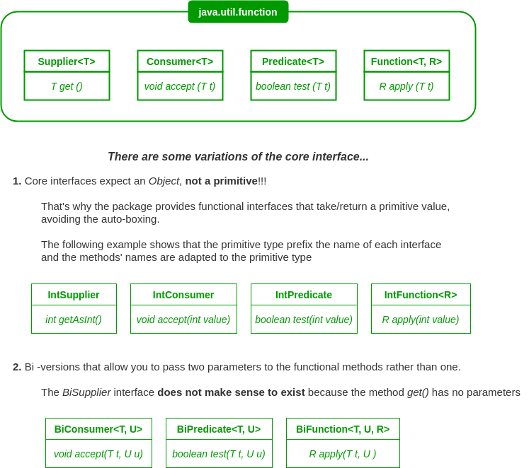

# Lambda expressions and functional interfaces
+ [Overview](#overview)
+ [Lambda expression](#lambda-expression)
+ [Functional interfaces](#functional-interfaces)
    - [Java core funtional interfaces](#java-core-funtional-interfaces)
    - [Working with ``Supplier``](#working-with-supplier)
    - [Working with ``Consumer``](#working-with-consumer)
    - [Working with ``Predicate``](#working-with-predicate)
    - [Working with ``Function``](#working-with-function)
        + [Operators](#operators)
+ [Method references](#method-references)

## Overview
In this module we dive into lambda details and we learn how to use some important functional interfaces of Java.

## Lambda expression
Follow equivalent lambda expression just to brush up on the syntax:
```java
// optional parenthesis for the parameter
DogQuerier dq = (d) -> d.getAge() > 9;
DogQuerier dq = d -> d.getAge() > 9;

// mandatory parenthesis because of the parameter type
DogQuerier dq = (Dog d) -> d.getAge() > 9;

// mandatory parenthesis because there is more than one parameter
DogQuerier dq = (d, n) -> d.getAge() > n;

// optional curly braces if there is only one statement 
DogQuerier dq = d -> { return d.getAge() > 9; };
```

Lambda expression could be passed in to method, as parameter.

> **EFFECTIVELY final variable** is a variable or parameter whose value isn't changed after it is initialized

What variables can I access from lambda? And what can I do with them?
 1. you can use the value of both final and effectively final variable, but you can't change their values!
 2. you can define and use variables in the body of lambda
```java
final String catType = "persian";   // final variable 
int numCats = 3;                    // EFFECTIVELY final variable

DogQuerier dqWithCats = d -> {
    // legal because the variable is defined and used in the body of lambda
    int numBalls = 1;
    numBalls++;
    System.out.println("Number of balls: " + numBalls);

    numCats++;  // COMPILER ERROR: can't change variable defined out of the body lambda

    // legal because you can use the value of final and EFFECTIVELY final variables
    System.out.println("Number of cats: " + numCats); 

    return d.getAge() > 9;
};
```

## Functional interfaces
We can recognize a functional interface in two ways:
 1. It has ONLY one abstract method (no default, no static)
    > **WARNING**: inherited abstract methods don't count
 2. It is marked by ``@FunctionalInterface`` annotation. It is useful because we get a compiler error if we try to add 
    a abstract method to an existing functional interface
    
Seeing these interfaces in use and using them yourself will help make them seem less abstract and more useful.    
One good way to see functional interfaces in use is to look at the Oracle API documentation for one of the interfaces 
and click on "USE" in the top navigation bar. This shows you how that functional interface is used in the rest of the JDK.

You can create your own functional interface from Java core interfaces.

Beyond Java core functional interfaces, we will see in the exam ``Comparator``, ``Comparable`` and ``Runnable``.

### Java core funtional interfaces
For the exam and the real life, we don't need to remember all 43 Java core functional interfaces of the ``java.util.function`` package.
It is enough to know that each of them belong to one of the four categories below and that there are some variations of them:



### Working with ``Supplier``
The abstract method of this core functional interface is:
```java
// no parameters
// return an Object
T get();
```
Normally a supplier is passed in to methods as an argument.

Look at [Suppliers](src/Suppliers.java) to see a real use of suppliers.

### Working with ``Consumer``
``Consumer`` is the opposite of ``Supplier``.

The abstract method of this core functional interface is:
```java
// one or more parameter
// do not return anything
void accept(T t);
```
One of the most commons use of consumers is as parameter of ``forEach()``, the method of ``Iterable`` interface. Consumer can change the field of iterated objects

This interface define other non-abstract methods:
```java
// DEFAULT
andThen( Consumer<? super T> after )  // chain several consumers executed sequentially
```

Look at [Consumers](src/Consumers.java) for more example.

### Working with ``Predicate``
The abstract method of this core functional interface is:
```java
// one or more parameters
// return the result of the predicate applied to the argument t
boolean test(T t);
```
It could be useful when we want to filter a collection based on a boolean condition.

This interface define other non-abstract methods:
```java
// STATIC
Predicate.isEqual(Object o)   // tests if two arguments are equal according to the equals() method of the Object class

// DEFAULT
negate()                                // the logical negation of this predicate
or( Predicate<? super T> other )        // represents a short-circuiting logical OR
and( Predicate<? super T> other )       // represents a short-circuiting logical AND
```
Look at [Predicates](src/Predicates.java) for more details.

### Working with ``Function``
The abstract method of this core functional interface is:
```java
// one or more parameters
// return an object. The argument and the returned type has different name 
// to indicate they could be the same or different
R apply(T t);
```

This interface define other non-abstract methods:
```java
// STATIC
Function.identity()   // return the input argument

// DEFAULT
andThen( Function<? super R,? extends V> after )    // execute functions in sequence
compose( Function<? super V,? extends T> before )   // execute functions in the reverse order
```
When we should use the identity function? 
Imagine a scenario where you have defined a method that takes a ``Function`` as an argument that changes a value
in a data structure. But in some cases, you don't want that value to change. 
In those cases, pass the identity ``Function`` as an easy "do nothing" operation.

Look at [Functions](src/Functions.java) for more details.

#### Operators
All the operators are, in fact, slightly modified versions of other functional interfaces.

For the exam you should only be familiar with ``UnaryOperator`` that extends the ``Function`` interface,
so its functional method is also ``apply()``, but the argument type and the returned type MUST BE the same.

Follow an example:
```java
// it specify only one type!
UnaryOperator<Double> log2 = v -> Math.log(v) / Math.log(2);
System.out.println(log2.apply(8.0));
```
It is used as parameter of ``replaceAll()``, for instance.

Look at [Functions](src/Functions.java) for more details.

## Method references
We know that lambda is a shorthand way of writing an instance of a class that implements a functional interface.
Well, the method references is shorthand way of writing a lambda.
```java
public class MethodRefs {
    
    public static void main(String[] args) {
        List<String> chocolates = Arrays.asList("white", "milk", "dark");
        chocolates.forEach( c -> System.out.println(c) );   // print with lambda
        chocolates.forEach(System.out::println);            // print with a method reference
        chocolates.forEach(MethodRefs::printTreeStatic);    // print with our own static method reference
    }
    
    public static void printTreeStatic(String t) {
        System.out.println("Tree name: " + t);
    }
}
```
There are four types of method references:
 1. static
 2. instance
 3. arbitrary object
 4. constructor