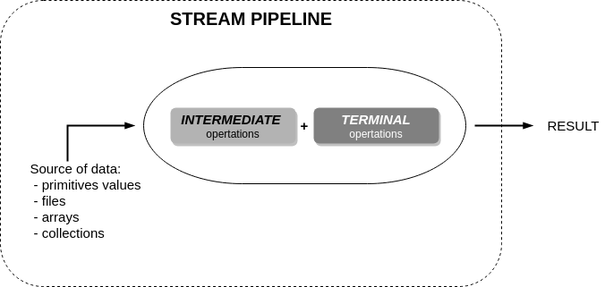
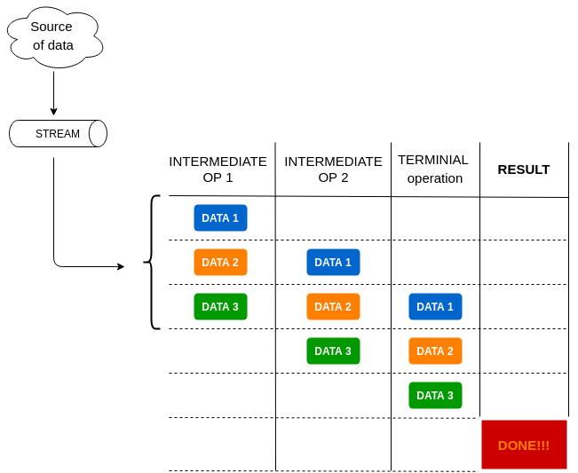

# Streams
+ [Overview](#overview)
+ [What is a stream](#what-is-a-stream)
    - [Map-filter-reduce](#map-filter-reduce)
    - [Optionals](#optionals)
    - [Searching](#serching)
    - [Sorting](#sorting)
+ [Exam tricks](#exam-tricks)


## Overview
In this module we introduce streams, new addition in Java 8. We will see how they work and the strict relationship with 
lambda and functional interfaces.

## What is a stream


Take into account that:
 * streams are LAZY: you MUST define the TERMINAL operation to start the execution, else nothing happen!
 * streams can be used only one time, else ``IllegalStateException`` is thrown!
 * stream PIPELINES are very efficient when you work with a large amount of data. Some streams could be parallelized to get more efficiency
 * each INTERMEDIATE operation return a stream
 
Stream pipelines are so good because Java optimize the execution of multiple operations as we can see in the example below:



You can create streams of both objects and primitive values. For the exam you MUST BE able to recognize each type and
their methods.

**Stream of objects** \
The class [StreamOfObjects](src/StreamOfObjects.java) shows the ways to get stream of objects from several data structure.

Follow the methods of ``Stream`` class for the exam:

| Method | Return |
| :----- | :----: |
| ``findAny()`` | ``Optional<T>`` |
| ``findFirst()`` | ``Optional<T>`` |
| ``max( Comparator<? super T> comparator )`` | ``Optional<T>`` |
| ``min( Comparator<? super T> comparator )`` | ``Optional<T>`` |
| ``reduce ( BinaryOperator<T> accumulator )`` | ``Optional<T>`` |
| ``filter ( Predicate<? super T> predicate )`` | ``Stream<T>`` |
| ``reduce ( T identity, BinaryOperator<T> accumulator )`` | ``T ``|
| ``count()`` | ``long`` |

**Stream of primitive values** \
The class [StreamOfPrimitives](src/StreamOfPrimitives.java) shows how to get a stream of integer, double or long primitives values.

It's really important to understand that they have their own little world. It means:
 * custom classes for the streams != ``Stream``
 * custom classes for the binary operators and predicates
 * INTERMEDIATE operations which return a value or an optional value
 * and so on...

Follow the methods and classes involved in the exam:
 
| Interface | Method | Return |
| :-------- | :----- | :----: |
| ``IntStream`` | ``reduce ( IntBinaryOperator op )`` | ``OptionalInt`` |
| ``DoubleStream`` | ``reduce( DoubleBinaryOperator op )`` | ``OptionalDouble`` |
| ``LongStream`` | ``reduce ( LongBinaryOperator op )`` | ``OptionalLong`` |
| ``DoubleStream`` <br/> ``IntStream`` <br/> ``LongStream`` | ``average()`` | ``OptionalDouble`` |
| ``DoubleStream`` <br/> ``IntStream`` <br/> ``LongStream`` | ``max()`` <br/> ``min()`` | ``OptionalDouble`` <br/> ``OptionalInt`` <br/> ``OptionalLong`` |
| ``DoubleStream`` <br/> ``IntStream`` <br/> ``LongStream`` | ``findAny()`` <br/> ``findFirst()`` | ``OptionalDouble`` <br/> ``OptionalInt`` <br/> ``OptionalLong`` |
| ``IntStream`` | ``filter ( IntPredicate predicate )`` | ``IntStream`` |
| ``DoubleStream`` | ``filter ( DoublePredicate predicate )`` | ``DoubleStream`` |
| ``LongStream`` | ``filter ( LongPredicate predicate )`` | ``LongStream`` |
| ``IntStream`` | ``reduce ( int identity, IntBinaryOperator op )`` | ``int`` |
| ``DoubleStream`` | ``reduce( double identity, DoubleBinaryOperator op )`` | ``double`` |
| ``LongStream`` | ``reduce ( long identity, LongBinaryOperator op )`` | ``long`` |
| ``DoubleStream`` <br/> ``IntStream`` <br/> ``LongStream`` | ``count()`` | ``long`` |
| ``DoubleStream`` <br/> ``IntStream`` <br/> ``LongStream`` | ``sum()`` | ``double, int, long`` |

### Map-filter-reduce
We can process streams in three steps:
 1. **Map**: convert each data into another one. For example, we have a list of objects and we map 
         the integer field of each object with the corresponding square
 2. **Filter**: apply one or more filters to the collection
 3. **Reduce**: invoke the TERMINAL operation that return a value or an OPTIONAL value
 
> **Think of reductions as accumulators**: they accumulate values from the
>  stream so they can compute one value
 
In addition to the reduce operation offered by Java API, you can write your own reduction using ``reduce()`` method
IF AND ONLY IF the operation is associative:
> (A op B) op C = A op (B op C)
>
> sum() is ASSOCIATIVE \
> average() is NOT ASSOCIATIVE
 
Look at the samples into [MapFilterReduceMethods](src/MapFilterReduceMethods.java) for more details.

### Optionals
We told above that some streams operations returns optional values. But what is it?
It's a container that may or may not contain a value.

Follow the methods of optionals that you will see in the exam:

| Class | Method | Return |
| :---- | :----- | :----: |
| ``Optional`` | ``empty()`` | ``Optional<T>`` |
| ``Optional`` | ``get()`` | ``T`` |
| ``Optional`` | ``ifPresent ( Consumer<? super T> consumer )`` | ``void`` |
| ``Optional`` | ``isPresent()`` | ``boolean`` |
| ``Optional`` | ``of()`` | ``Optional<T>`` |
| ``Optional`` | ``ofNullable()`` | ``Optional<T>`` |
| ``Optional`` | ``orElse()`` | ``T`` |
| ``OptionalInt`` <br/> ``OptionalDouble`` <br/> ``OptionalLong`` | Each has similar methods to the above methods that return primitive optionals or primitives for each type | ``int`` <br/> ``double`` <br/> ``long`` |

### Searching
The methods below are used to search elements in the stream:
```java
// determine whether a match exists or not
allMatch()
anyMatch()
noneMatch()

// return an object, but it does not depend on the order the elements were processed
findFirst()
findAny()
```

All searching methods:
 * are TERMINAL operations: they return a single value
 * are short-circuiting operations: as soon as the result is determined, then the operation stops
 * can be parallelized
 
Some example is available in [SearchingStream](src/SearchingStream.java)

### Sorting
The ``Stream`` interface provides some methods to sort elements:
```java
// sort stream by natural order
sorted()

// sort stream by custom order
sorted( Comparator<? super T> comparator )

// remove stream's duplicates
distinct()
```

Some example is available in [SortingStream](src/SortingStream.java)

## Exam tricks
> **Stream of Wrapper class != stream of primitives**
>
> Be careful on the exam:
> ```
> // streams of wrapper classes are stream of objects
> Stream<Integer>
> Stream<Double>
> Stream<Long>
> 
> // streams of primitives values
> IntStream
> DoubleStream
> LongStream
> ```

> **Get value from an optional**
>
> ``Optional<T>``    : ``get()`` \
> ``OptionalInt``    : ``getAsInt()`` \
> ``OptionalDouble`` : ``getAsDouble()`` \
> ``OptionalLong``   : ``getAsLong()``

> **All searching methods are short-circuiting**
>
> ```java
> List<String> strings = Arrays.asList("mike", "philiph", "jefferson");
>  
> Optional<String> name = strings.stream()
>             .filter(s -> s.length() > 5)
>             .peek(s -> System.out.println("peek() = " + s))
>             .findAny();
>
> name.ifPresent(s -> System.out.println("searching result = " + s));
> ```
> if you're asked on the exam what output you'll see with a peek() you could answer:
>  1. **ERROR** : shows all the elements of the stream
>  2. **CORRECT** : shows the first element that match the filter because all searching methods of the streams, like ``findAny()``, are short-circuiting