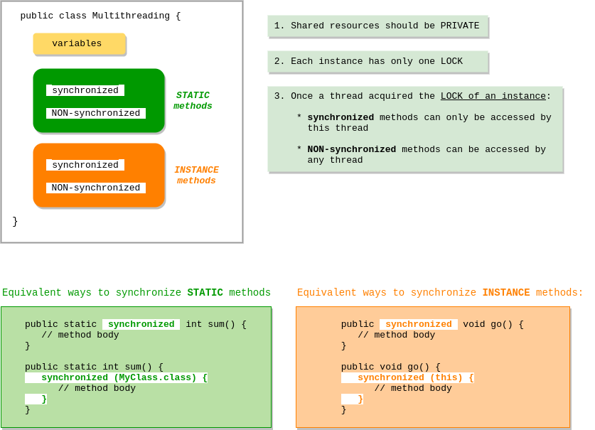
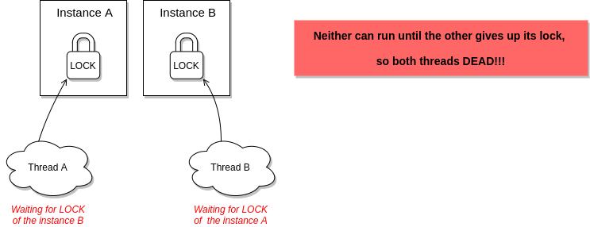
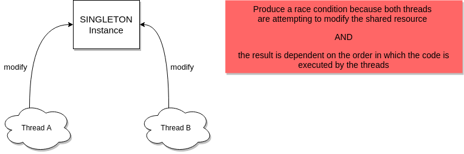
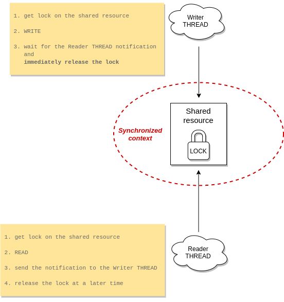

# Threads
+ [Overview](#overview)
+ [Defining threads](#defining-threads)
+ [Instantiating threads](#instantiating-threads)
+ [Starting threads](#starting-threads)
+ [Thread states and transistions](#thread-states-and-transistions)
+ [Preventing thread execution](#preventing-thread-execution)
    - [Sleep threads](#starting-threads)
    - [Yield threads](#yield-threads)
    - [Join threads](#join-threads)
+ [Multithreading problems](#multithreading-problems)
    - [Blocking on synchronized methods](#blocking-on-synchronized-methods)
    - [Thread-safe classes](#thread-safe-classes)
    - [Deadlock](#deadlock)
    - [Livelock](#livelock)
    - [Starvation](#starvation)
    - [Race condintion](#race-condintion)
+ [Thread interaction](#thread-interaction)
+ [Exam tricks](#exam-tricks)

## Overview
In this module we treat with the creation of worker threads using ``Runnable``, callable, and the use of the ``ExecutorService``
to concurrently execute tasks.

Then we will see how to identify potential threading problems among deadlock, starvation, livelock and race conditions.

We will end up to learn when we should use ``synchronized`` keyword and how to use ``java.util.concurrent.atomic`` 
package to control the order of thread execution.

## Defining threads
You can define a thread in one of two ways:
 1. Extend the ``java.lang.Thread`` class
    ```java
    class MyThread extends Thread { }
    ```
    * This approach does not allow to extend another class.
    * You could both override and overload ``run()`` method
 2. Implement the ``Runnable`` functional interface
    ```java
    class MyRunnable implements Runnable {
        public void run() {
            System.out.println("MyRunnable is executing");
        }
    }
    ```
    * You must implement ``run()`` method of the interface
    * You can instantiate ``MyRunnable`` with ``new()``
    * You can instantiate ``MyRunnable`` with lambda as ``Runnable``is a functional interface
   
For the exam you should know at minimum the following methods of ``Thread`` class:  
```java
// instance methods
start()
run()
getName()
setName("thread 1")

// static method
yield()
sleep()
Thread.currentThread().getId()  // get a positive unique long number that identify the current thread
Thread.currentThread().getName()  // get the name of the current thread
```

## Instantiating threads
You always need a ``Thread`` to do the job that could be implemented in two way:
 1. with the method ``run()`` of ``Thread`` object instantiated with one of the constructors below
    ```java
    // the method run() of this object is invoked
    Thread()
    Thread(String name)
    ```
 2. with the method ``run()`` of the ``Runnable`` instance. In this case you will pass it to one of the following constructors
    ```java
    // if the target is null, the method run() of the Thread object is invoked
    Thread(Runnable target)
    Thread(Runnable target, String name)
    ```

## Starting threads
Define and instantiating a ``Thread`` is not enough to run it because you need to invoke ``start()`` method on 
the ``Thread`` object. It make three things:
 1. A new thread of execution starts (with a new call stack)
 2. The thread moves from the NEW state to the RUNNABLE state
 3. It is ready to be executed by scheduler
 
You can check in every moment if a thread is alive with the method ``isAlive()``. A thread is alive if it has been started and has not yet died

> **WARNING** \
> Invoking directly the method ``run()`` of a ``Thread`` instance DOES NOT mean that it will run in a separate thread!!!

If you start a single thread it works as we expect, but It's not true when we start multiple threads. 

Nothing is guaranteed except the that each thread will start and will run to completion.
It means that running the same code multiple times on the same machine or on several machines the results could not be the same!!! Why?

The scheduler manages the threads based on its own scheduling policy and we have no the total control over it, but we
can influence the scheduling with the following methods:
```java
// methods of Thread class
public static void sleep(long millis) throws InterruptedException
public static void yield()
public final void join() throws InterruptedException
public final void setPriority(int newPriority)

// method inherited by Object class
public final void wait() throws InterruptedException
public final void notify()
public final void notifyAll()
```

Some example of how to define, instantiate and start a thread is on [DefineInstantiateStartThreads](src/DefineInstantiateStartThreads.java).

## Thread states and transistions


## Preventing thread execution
Burn in your mind that in a multithreads environment you have no total control over the scheduler, but you could 
influence its behaviour with the following methods:
 * ``Thread.sleep()``
 * ``Thread.yield()``
 * ``join()``

This section resume the most important aspects of these features and the important concept of thread priority.

### Thread priority
Each thread has a priority that is used in some way by scheduler policy to pick up threads from the pool of runnable ones. 
You can set the priority with the instance method ``setPriority(int newPriority)``.

Normally, thread priority is an integer between 1 and 10, while the default values is usually 5.
```java
// constants of the Thread class
Thread.MIN_PRIORITY (1)
Thread.NORM_PRIORITY (5)
Thread.MAX_PRIORITY (10)
```

> **WARNING**
>
> Don't rely on thread priorities when designing your multithreaded application.
> Because thread-scheduling priority behavior is not guaranteed, it’s better to
> avoid modifying thread priorities. Usually, default priority will be fine.

### Sleep threads
The static method ``Thread.sleep()`` could be invoked in the thread code to sleep it at least for the period of time
specified as parameter (milliseconds). We said AT LEAST because when the thread wake up its state is changed to RUNNABLE.
We don't know how much time it need to be run by scheduler!

> **WARNING**
>
> One thread could not send another thread to sleep!!! 

Look at the sample on [SleepThread](src/SleepThread.java)

### Yield threads
The static method ``Thread.yield()`` suggests to the scheduler to move back to the RUNNABLE state the current thread 
in order to allow the execution of another thread from the pool. The scheduler could ignore this suggestion.

### Join threads
The non-static method ``join()`` allows to execute one thread when another is moved to DEAD state.
It's the case where the thread A need that the thread B finished to be executed.  

## Multithreading problems
In this section we will talk about several issues of multithreading applications.

First of all you should know how multithreading application should work:


### Blocking on synchronized methods
For the exam and the real life we must be able to recognize the scenarios where threads could be blocked getting lock of an instance

| Scenario | Threads blocked |
| :------: | :-------------: |
| Thread A get lock on the instance I | Each thread that try to invoke **non-static synchronized** methods of the same instance I |
| Thread A get lock on the class C | Each thread that try to invoke **static synchronized** methods of the same class C |
| synchronized block | Each thread that try to synchronize on the same object between parentheses after the **synchronize** keyword |

The scenarios below block threads:
 * Non-static methods access STATIC fields
 * STATIC methods access non-static fields

You can fix it avoiding this mix, as follow:
 * STATIC fields accessed by STATIC synchronized methods
 * Non-static fields accessed by non-static synchronized methods
 
Access both STATIC and non-static fields in a method is possible, but it's not on the scope of the exam.
 
> **WARNING**
>
> Access a "thread-safe" variable (e.g. synchronized collection) with a non-synchronized method DOES NOT MAKE your code "thread-safe"!!!

### Thread-safe classes
A class is not considered thread-safe only because its field is of thread-safe type, as you can see in the example 
[NonThreadSafeClass](src/thread_safe_classes/NonThreadSafeClass.java).

Only if you synchronize all methods that access that field you will be sure that your class is thread-safe. 
The [ThreadSafeClass](src/thread_safe_classes/ThreadSafeClass.java) is the thread-safe version of the previous example.

### Deadlock


An example of deadlock risk is on [Deadlock](src/Deadlock.java) and you can fix it swapping the order of locking for
either the method ``read()`` or ``write()``. 

### Livelock


Java reduced a lot the probability of livelock with ``ReentrantLock`` that is treated in depth in the concurrency module.

### Starvation
Starvation is like the consequence of livelock: a thread that could not make progress because it cannot get access 
to a shared resource that other threads are hogging.

A couple of examples:
 1. another thread gets access to a synchronized resource and then goes into an infinite loop or takes a really long time to use the resource
 2. some threads are waiting for a resource, but one of them always gets it because it has the higher priority
 
A good solution could be a scheduler that allocate time fairly between threads.

### Race condintion


The class [RaceCondition](src/RaceCondition.java) include an example of race condition based on the singleton pattern. 
It can be fixed with a couple of changes:
 * make ``volatile`` the shared resource  (INSTANCE variable)
 * synchronize all methods that access the shared resource (in this example just the method ``getInstance()``) 

## Thread interaction
The most complex aspect of the thread is their interaction, there is no doubt. 

It consists of two things:
 1. Object lock: we said that each instance has its own lock that could be acquired by one thread at a time
 2. ``wait()``, ``notify()``, and ``notifyAll()`` allows threads to communicate the status of an event

> IMPORTANT
>
> The methods ``wait()``, ``notify()``, and ``notifyAll()`` can be called if and only if:
>  1. we are in a synchronized context (synchronized method or block)
>  2. the thread own the LOCK on the object, else the unchecked exception ``IllegalMonitorStateException`` will be thrown!!!



The example [WaitingNotification](src/thread_interaction/WaitNotify.java) highlight the most important details
of how two threads could share a resource. By the way, it could be improved:
 * put a queue between the writer THREAD and the resource
 * replace ``wait()`` with ``wait(long millis)`` to be sure that thread will no wait indefinitely 

## Exam tricks
> **What is and is not guaranteed**
> 
> In the exam you MUST demonstrate to know what IS and IS NOT guaranteed behaviour, regardless the JVM

> **DAEMON threads**
> 
> Don't worry, in the exam there are no questions about this topic!

> **Instantiate thread with another thread**
>
> ```java
> // a bit silly, but LEGAL
> Thread t = new Thread( new MyThread() );
> ```

> **One thread can be started only one time**
>
> The runtime ``IllegalThreadStateException`` will be thrown if you start a thread that was executed previously

> **``Thread.sleep()``**
>
> Don't rely on this method to give you a perfectly accurate timer!!!

> **LOCK release**
>
> It's very important to understand that when the thread invoke ``wait()`` on the instance, immediately release the lock.  
> It's NOT TRUE for the method ``notify()``